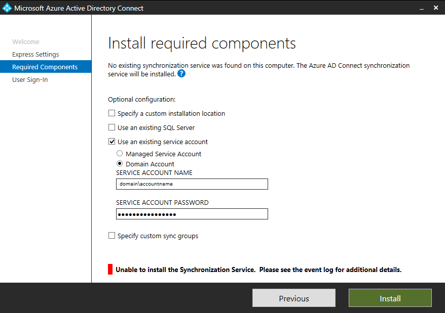

# Azure AD Connect - installation error

**Error:** Unable to install the Synchronization Service. Please see the event log for additional details.

## Application Log

EnableADSyncBootstrapLocalDBInstance: Error while attempting to enable local db instance. Details: Microsoft.Azure.ActiveDirectory.Client.Framework.ProcessExecutionFailedException: Exception: Execution failed with errorCode: 1.

Details: Sqlcmd: Error: Microsoft SQL Server Native Client 11.0 : Encryption not supported on the client..

Sqlcmd: Error: Microsoft SQL Server Native Client 11.0 : SSL Provider: The client and server cannot communicate, because they do not possess a common algorithm.

## Reason

Current AD Connect version (1.1.553.0) is shipped with Microsoft SQL Server 2012 Native Client version 11.0.2100.60. By default AD connect works over TLS 1.0. In environments where TLS 1.0 is disabled Synchonization Service can't be installed because Native client doesn't support TLS 1.2.

## Fix

Install never version of SQL Native Client, for example 11.3.6020.0. Obviously all required changes to allowed ciphers, manual RC2/4 hardening (in case of .Net 4.6), SchUseStrongCrypto etc. need to be reviewed and applied as well (many articles about it).