# Group Policy - Processing Order

I think one of the most important things in administering Active Directory (AD) is the understanding of Group Policy processing order. In this blog post I will highlight this process and provide some examples. Also it will include an explanation of Loopback processing and Group Policy enforcement.

I will create the following Organizational Unit (OU) structure for tests.

`AD.FEDENKO.INFO/TestOU/TestSubOU`

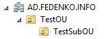

There will be Group Policy objects (GPO's) for each Organizational Unit including Domain and Site.

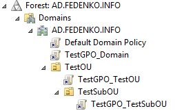

As result TestSubOU Organizational Unit will have the following GPO's assigned.

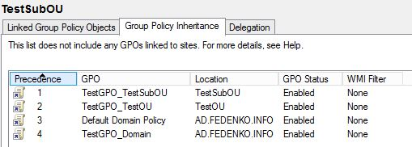

The client workstation will be located in TestSubOU and called CLIENT01. It will be located in Active Directory Site called Users. GPO will also be assigned to this AD Site.


Just to summarize the list of GPO's used:  
TestGPO_Domain - policy which is assigned to the domain.  
TestGPO_TestOU - OU policy.  
TestGPO_TestSubOU - child OU policy.  
TestGPO_Site - AD Site policy.

The Group Policies are processed in the following order:

1. Local Computer Group Policy (can be edited by running Local Group Policy Editor - gpedit.msc)
2. Site Policy.
3. Domain Policy.
4. Organizational Unit policy.

According to that information GPO settings on our test workstation will be processed in the following order:

1. Local Policy of CLIENT01. Note: Processing of Local GPO's can be disabled by "Turn off Local Group Policy Objects processing" settings, which can be found under "Computer Configuration - Policies - Administrative Templates - System - Group Policy".
2. TestGPO_Site
3. TestGPO_Domain
4. TestGPO_TestOU
5. TestGPO_TestSubOU

It means if for example TestGPO_TestSubOU and TestGPO_TestOU (even if domain and site GPO's) have the same settings, TestGPO_TestSubOU will take precedence over all of them. One interesting fact that TestGPO_TestOU will be still listed in Applied GPO's output from Group Policy Results wizard even if no settings were applied form that GPO.

GPO's have Computer and User configuration sections. You should remember that Computer settings from GPO's which are applied to User account never take effect. One exception can be User settings from GPO's which are applied to Computer account. By default they are not being applied. It can be changed by configuring Loopback Processing.

Loopback processing allows controlling Group Policy settings depending on which computer user authenticates to. Loopback processing has two modes: Merge or Replace. In first mode it applies User settings from all GPO's which are assigned to both Computer and User accounts. You should remember that if there any GPO settings conflicts (the same user settings), settings from GPO which is assigned to Computer object will take precedence. Another mode is Replace. It means that User account GPO's are ignored completely and not being applied.

Loopback processing can be enabled by amending "Configure user Group Policy loopback processing mode" settings in "Computer Configuration - Policies - Administrative Templates - System - Group Policy".

Another topic which I would like to highlight is Group Policy enforcement. It allows you to enforce GPO to be applied last and in fact have precedence over all GPO's. For example if I mark Enforced  TestGPO_Domain Group Policy. Its settings will have precedence over all GPO's.

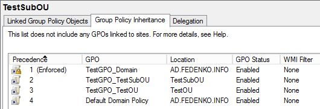

Something not obvious will happen if you Enforce AD Site Group Policy Object, In our case it is TestGPO_Site.

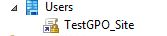

You will not see it in Group Policy Inheritance tab but it is Enforced and take precedence over all Group Policy Objects so pay attention here.

Another not obvious thing will happen if you enforce all GPO's. Actually I expected to see TestGPO_TestSubOU with Precedence #1 but in fact I see the following picture.

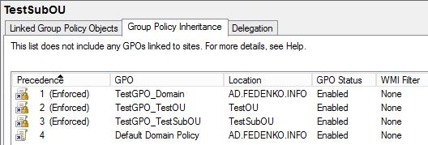

Yes, that's correct. In my opinion it is not logically but anyway pay attention on it as well. I have not highlighted blocking inheritance. I believe the screenshot below will explain it very well.

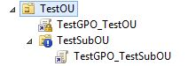

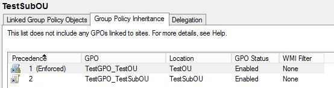

## Group Policy - Loopback processing or WMI filters

This topic shows an example of solving Group Policy task, where some group policy needs to be excluded from applying on a specific computer.

Let’s start what we have. There is a parent Organizational Unit called “TEST_OU”. Inside we have Computers and Users OU’s as on a screenshot below.

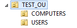
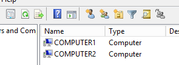

COMPUTERS OU contains computer objects (Computer1 and Computer2) and USERS OU has only user objects (User1 and User2).

Group Policies are configured in the following way - ComputerPolicy1/2 are linked to COMPUTERS OU and have only Computer Settings, UserPolicy1/2 are linked to USERS OU and have only Users Settings configured.

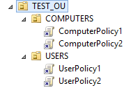

### Task: Do not apply UserPolicy2 when User1 or User2 logon to Computer1 and Computer2

There are 2 ways to solve this task:

1. Link UserPolicy1 to COMPUTERS OU and enable Loopback processing in Replace mode. In this case UserPolicy2 will be ignored.
2. Use WMI Filer on UserPolicy2.

Here I will show how to do a second option. The filter below will exclude UserPolicy2 from applying on Computer1 and Computer2 objects.

```text
root\CIMv2
SELECT * FROM Win32_ComputerSystem WHERE NOT Name LIKE 'COMPUTER1' AND NOT Name LIKE 'COMPUTER2'
```

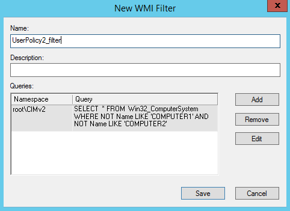

Then link WMI filter to UserPolicy2.

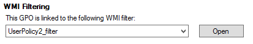

Now UserPolicy2 shouldn’t be applied when User1 or User2 logons to Computer1/2.