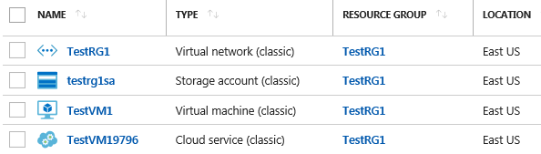
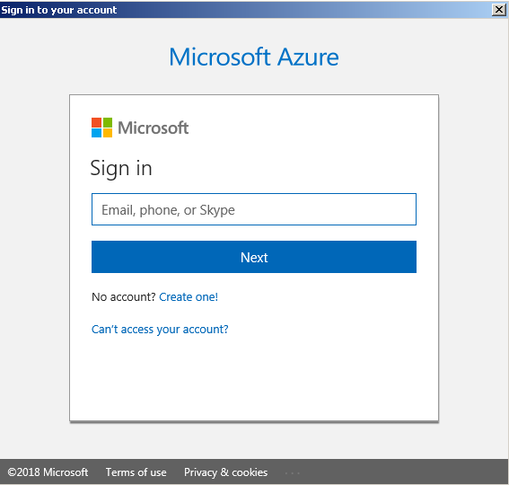
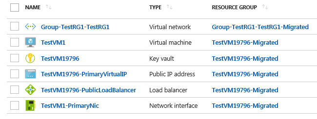
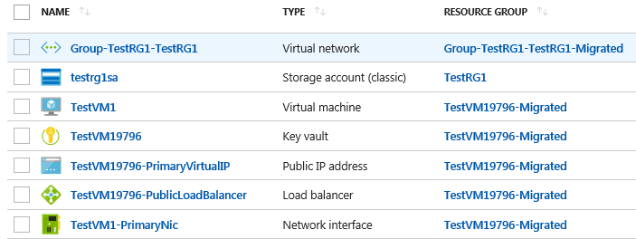

# Microsoft Azure - Migrate from ASM to ARM

In this post I show how to migrate supported IaaS resource from classic deployment model to Azure Resource Manager. PowerShell will be used to achieve this task. Make sure that you are an administrator for your Azure subscription and your Azure region has enough available vCPU's resources (refer to ARM limits).



Items for migration:  
TestRG1 - Virtual network (classic)  
Testrg1sa - Storage account (classic)  
TestVm1 - Virtual machine (classic)  
TestVM19796 - Cloud service (classic)

**Step 1:** Install Azure PowerShell command-line tools from Microsoft Azure download page - https://azure.microsoft.com/en-us/downloads/ It is used for managing classic resources.

**Step 2:** Install Azure PowerShell to manage ARM resources by running command below.

```powershell
Install-Module -Name AzureRM -AllowClobber
```

**Step 3:** Login to ARM.

```powershell
Login-AzureRmAccount
```

```text
Account          : admin@example.com
SubscriptionName : Your Azure Subscription Name
SubscriptionId   : xxxxxxxx-xxxx-xxxx-xxxx-xxxxxxxxxxxx
TenantId         : xxxxxxxx-xxxx-xxxx-xxxx-xxxxxxxxxxxx
Environment      : AzureCloud
```

You will be asked for Azure Credentials.



**Step 4:** Select Azure subscription. Can be done by command below if you have only one subscription. Refer to Select-AzureRmSubscription cmdlet.

```powershell
Get-AzureRmSubscription | Select-AzureRmSubscription
```

```text
Name             : [admin@example.com, xxxxxxxx-xxxx-xxxx-xxxx-xxxxxxxxxxxx
Account          : admin@example.com
SubscriptionName : Your Azure Subscription Name
TenantId         : xxxxxxxx-xxxx-xxxx-xxxx-xxxxxxxxxxxx
Environment      : AzureCloud
```

**Step 5:** Register migration resource provider. It is one-time operation. Make sure that RegistrationState is Registered before any migrations.

```powershell
Register-AzureRmResourceProvider -ProviderNamespace Microsoft.ClassicInfrastructureMigrate
```

```text
ProviderNamespace : Microsoft.ClassicInfrastructureMigrate
RegistrationState : Registered
ResourceTypes     : {classicInfrastructureResources}
Locations         : {East Asia, Southeast Asia, East US, East US 2...}
```

**Step 6:** Login to Azure classic. You will be asked to provide the credentials as on step #3.

```powershell
Add-AzureAccount
```

```text
Id              : admin@example.com
Type            : User
Subscriptions   : xxxxxxxx-xxxx-xxxx-xxxx-xxxxxxxxxxxx
Tenants         : xxxxxxxx-xxxx-xxxx-xxxx-xxxxxxxxxxxx
```

**Step 7:** Select Azure subscription by running command below. List of available subscriptions can be found by running Get-AzureSubscription cmdlet.

```powershell
Select-AzureSubscription -SubscriptionName "Your Azure Subscription Name"
```

**Step 8:** Find out Virtual network name and put it into variable.

```powershell
(Get-AzureVnetSite).Name

Group TestRG1 TestRG1

$vnetName = "Group TestRG1 TestRG1"
```

**Step 9:** Validate if you are eligible to migrate the virtual network. Make sure that Validation Passed. As you can see all resources except Storage account are selected for migration.

```powershell
Move-AzureVirtualNetwork -Validate -VirtualNetworkName $vnetName
```

```text
OperationId        : xxxxxxxx-xxxx-xxxx-xxxx-xxxxxxxxxxxx
Result             : Validation Passed. Please see ValidationMessages object for a list of resources that will be migrated.
ValidationMessages : {Group TestRG1 TestRG1, TestVM19796, TestVM19796}
```

**Step 10:** Prepare for Virtual network migration. Operation status should be Succeeded.

```powershell
Move-AzureVirtualNetwork -Prepare -VirtualNetworkName $vnetName
```

```text
OperationDescription     OperationId                          OperationStatus
--------------------     -----------                          ---------------
Move-AzureVirtualNetwork xxxxxxxx-xxxx-xxxx-xxxx-xxxxxxxxxxxx Succeeded
```

**Step 11:** By default after preparation step is completed the following resources are created in Azure Portal divided by 2 Resource groups: TestVM19796-Migrated (Virtual Machine, Key vault, Public IP address, Load balancer and Network interface) and Group-TestRG1-TestRG1-Migrated (Virtual network).



**Step 12:** At this stage you can check created resources and configurations. There are two options: Abort and Commit. First parameter will revert configuration to the old state and removes all created ARM resources. Commit parameter will write the changes and remove classic resources from Azure portal.

```powershell
Move-AzureVirtualNetwork -Commit -VirtualNetworkName $vnetName
```

```text
OperationDescription     OperationId                          OperationStatus
--------------------     -----------                          ---------------
Move-AzureVirtualNetwork xxxxxxxx-xxxx-xxxx-xxxx-xxxxxxxxxxxx Succeeded
```

**Step 13:** After Commit operation is completed, classic resources will be removed from Azure Portal. Only Storage account left at this stage.



**Step 14:** Next migrate Storage account. Check if you are ready for migration by Validate step.

```powershell
Move-AzureStorageAccount -Validate -StorageAccountName "SA Name"
```

```text
OperationId        : xxxxxxxx-xxxx-xxxx-xxxx-xxxxxxxxxxxx
Result             : Validation Passed. Please see ValidationMessages object for a list of resources that will be migrated.
ValidationMessages : {testrg1sa}
```

**Step 15:** Prepare Storage account migration.

```powershell
Move-AzureStorageAccount -Prepare -StorageAccountName "SA Name"
```

```text
OperationDescription     OperationId                          OperationStatus
--------------------     -----------                          ---------------
Move-AzureStorageAccount xxxxxxxx-xxxx-xxxx-xxxx-xxxxxxxxxxxx Succeeded
```

You will see 2 entries in Azure Portal.


**Step 16:** Finalize storage account migration by Commit parameter.

```powershell
PS C:\> Move-AzureStorageAccount -Commit -StorageAccountName "SA Name"
```

```text
OperationDescription     OperationId                          OperationStatus
--------------------     -----------                          ---------------
Move-AzureStorageAccount xxxxxxxx-xxxx-xxxx-xxxx-xxxxxxxxxxxx Succeeded
```