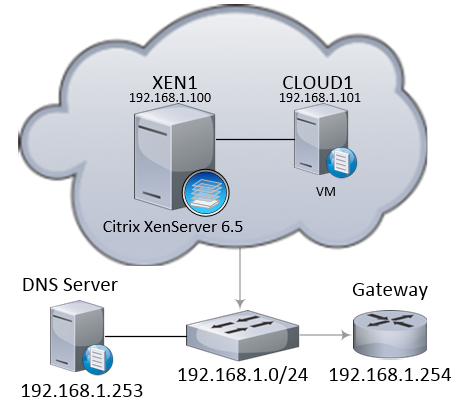

# CloudStack - XenServer - single server deployment

This doc shows how to deploy CloudStack on a single XenServer. Obviously non production example, simply a proof of concept case.

Requirements:
Subnet - 192.168.1.0/24.
Gateway - 192.168.1.254.
DNS Server - 192.168.1.253.
XEN1 (192.168.1.100) - XenServer 6.5 with all patches installed.
CLOUD1 (192.168.1.101) - Ubuntu 14.04.2 - "apt update | apt upgrade". VM running on XEN1.



It will be CloudStack 4.9 deployment on CLOUD1 virtual machine, which is running on XEN1. CLOUD1 will act as CloudStack management server, MySQL server and NFS server. 

Make sure that FQDN is set correctly.

```text
CLOUD1# hostname --fqdn
```

Install NTP

```text
CLOUD1# apt-get install openntpd
```

Add repository

```text
CLOUD1# nano /etc/apt/sources.list.d/cloudstack.list
deb http://cloudstack.apt-get.eu/ubuntu precise 4.9
```

Add public key

```text
CLOUD1# wget -O - http://cloudstack.apt-get.eu/release.asc|apt-key add -
CLOUD1# apt-get update
```

Install CloudStack Management package

```text
CLOUD1# apt-get install cloudstack-management
```

Install vhd-util

```text
CLOUD1# wget http://download.cloud.com.s3.amazonaws.com/tools/vhd-util
```

Copy vhd-util to the scripts folder

```text
CLOUD1# cp vhd-util /usr/share/cloudstack-common/scripts/vm/hypervisor/xenserver
```

Install Database server

```text
CLOUD1# apt-get install mysql-server
```

Amend MySQL configuration file under [mysqld] section

```text
CLOUD1# nano /etc/mysql/my.cnf
```

```text
innodb_rollback_on_timeout=1
innodb_lock_wait_timeout=600
max_connections=350
log-bin=mysql-bin
binlog-format = 'ROW'
```

Restart MySQL daemon

```text
CLOUD1# service mysqld restart
```

Setup CloudStack Database, where password1 is for cloud user and password2 is MySQL root password

```text
CLOUD1# cloudstack-setup-databases cloud:password1@localhost --deploy-as=root:password2 -i 192.168.1.101
```

Setup Management Server

```text
CLOUD1# cloudstack-setup-management
```

Install and configure NFS

```text
CLOUD1# apt-get install nfs-kernel-server
CLOUD1# mkdir -p /export/primary
CLOUD1# mkdir -p /export/secondary
CLOUD1# nano /etc/exports
/export *(rw,async,no_root_squash,no_subtree_check)
CLOUD1# exportfs -a
```

Prepare system template

```text
CLOUD1# /usr/share/cloudstack-common/scripts/storage/secondary/cloud-install-sys-tmplt -m /mnt/secondary -u http://cloudstack.apt-get.eu/systemvm/4.6/systemvm64template-4.6.0-xen.vhd.bz2 -h xenserver -F
```

Prepare XenServer

```text
XEN1# xe-switch-network-backend bridge
```

XEN1 is ready to be added to the CloudStack.

Login to `http://cloud1:8080/client` and setup the first zone.