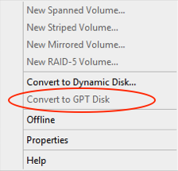
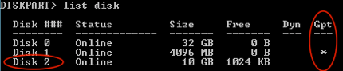
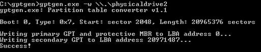
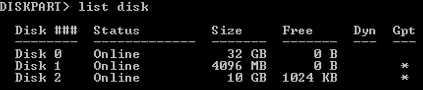

# Windows Server - Convert MBR to GPT without data loss

It is possible to convert MBR to GPT disk using standard Windows Disk Management tool. However, it does require no volumes on it. Otherwise "Convert to GPT Disk" will be greyed out.

In this case you can use gptgen tool, which allows online disk conversion without the need to destroy the volume and its data. First of all use **Diskpart** tool to identify disk number. In my case it is Disk 2.

Then run **gptgen** tool with the following parameters **“gptgen.exe -w \\.\physicaldrive2”**, where 2 is the disk number from **Diskpart** tool.

Run **Diskpart** to check if the settings are applied successfully.

