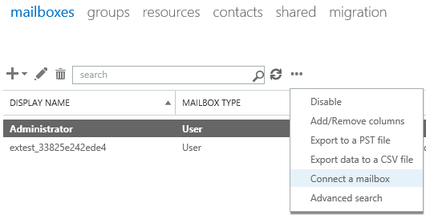

# Exchange Server - Connect a disabled mailbox

Easy way to restore a mailbox if you accidentally removed it. Simply reconnect it back using steps described [here](https://technet.microsoft.com/en-us/library/jj863439(v=exchg.150).aspx)



But sometimes a removed mailbox doesn't show up as a disconnected one. In this case you need to synchronize the mailbox state with its AD account using `Update-StoreMailboxState` cmdlet.

First of all find a MailboxGuid and Database name of removed mailbox:

```powershell
Get-MailboxDatabase | Get-MailboxStatistics | Where { $_.DisplayName -eq "Display Name" } | ft DisplayName,Database,MailboxGuid 
```

Then update the mailbox state:

```powershell
Update-StoreMailboxState -Database DBNAME -Identity MailboxGUID
```

Then the mailbox will show up in the disconnected mailboxes as well as DisconnectReason attribute will be updated. The mailbox will be ready to reconnect.