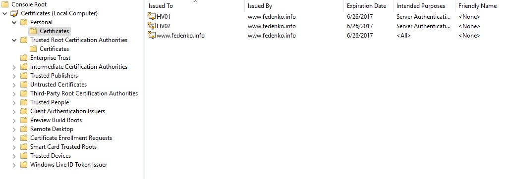
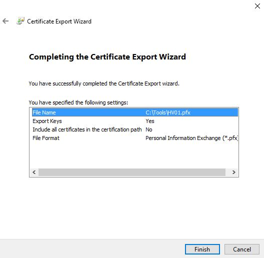
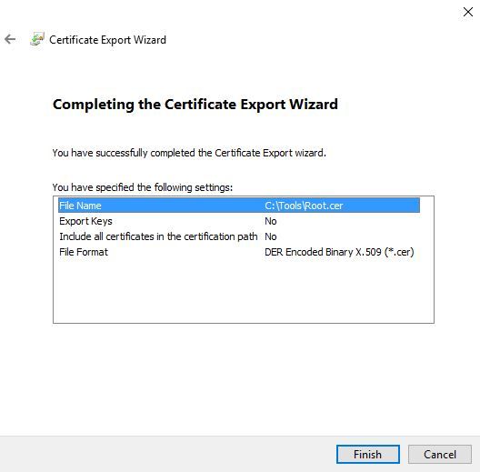
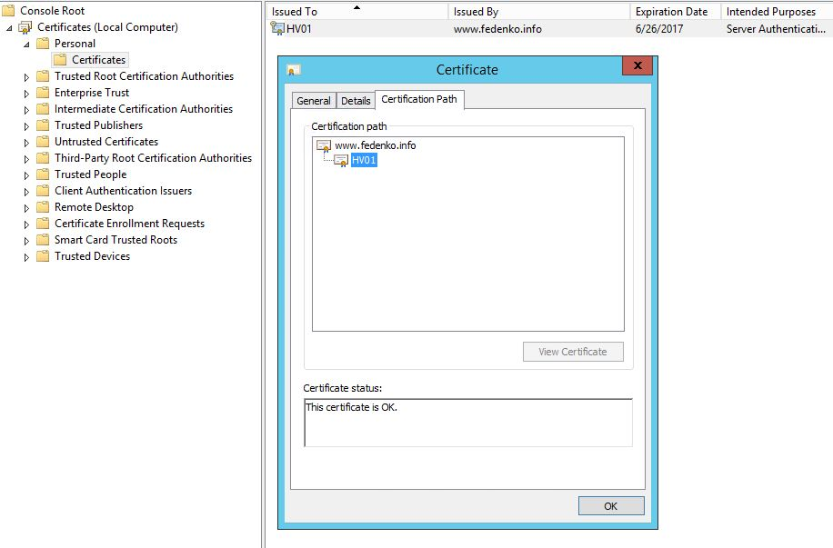
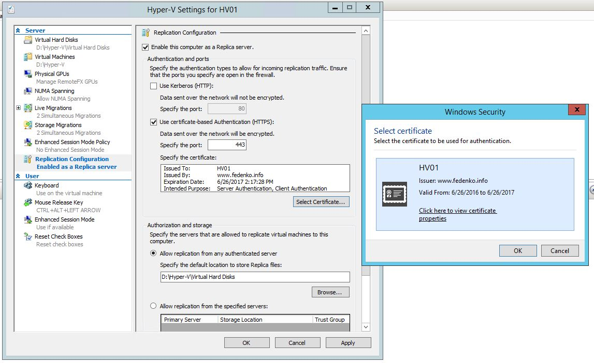

# Hyper-V Replica with self-signed certificates

I have two standalone non-domain joined Hyper-V servers - HV01 and HV02 (both Windows Server 2012 R2). I need to configure Hyper-V replica between them. Many blog posts and guides provide syntax for **MakeCert** tool. Interesting thing is that MakeCert is deprecated and it is recommended to use **New-SelfSignedCertificate** cmdlet instead. Of course it is great but there are some limitations of this cmdlet in PowerShell 4.0. Actually there is a huge difference between **New-SelfSignedCertificate** cmdlet in PowerShell 4.0 and 5.0 (just look at TechNet and see, two different cmdlet's). I am going to create self-signed certificate using new cmdlet that's why I use Windows 10 with PowerShell 5.0 (WMF 5 doesn't work, you have to use Windows 10 or Windows Server 2016). The name of Windows 10 workstation will be ADMIN01.

## Go to ADMIN01 and generate root certificate

It will be used to sign certificates for HV01 and HV02. Sure you can use -NotAfter setting to specify certificate expiration date but this property was omitted here:

```powershell
New-SelfSignedCertificate -Type "Custom" -KeyExportPolicy "Exportable" -Subject "CN=www.fedenko.info" -CertStoreLocation "Cert:\LocalMachine\My" -KeySpec "Signature" -KeyUsage "CertSign"
```

```cmd
    Directory: Microsoft.PowerShell.Security\Certificate::LocalMachine\My

Thumbprint                                Subject
----------                                -------
2752C9823DBE015B60F4C5558DBB7CFEF1FD80AB  CN=www.fedenko.info
```

## Create and sign certificates for HV01 and HV02

Make sure that you specify thumbprint of certificate above.

```powershell
New-SelfSignedCertificate -type "Custom" -KeyExportPolicy "Exportable" -Subject "CN=HV01" -CertStoreLocation "Cert:\LocalMachine\My" -KeySpec "KeyExchange" -TextExtension @("2.5.29.37={text}1.3.6.1.5.5.7.3.1,1.3.6.1.5.5.7.3.2") -Signer "Cert:LocalMachine\My\2752C9823DBE015B60F4C5558DBB7CFEF1FD80AB" -Provider "Microsoft Enhanced RSA and AES Cryptographic Provider"
```

```powershell
New-SelfSignedCertificate -type "Custom" -KeyExportPolicy "Exportable" -Subject "CN=HV02" -CertStoreLocation "Cert:\LocalMachine\My" -KeySpec "KeyExchange" -TextExtension @("2.5.29.37={text}1.3.6.1.5.5.7.3.1,1.3.6.1.5.5.7.3.2") -Signer "Cert:LocalMachine\My\2752C9823DBE015B60F4C5558DBB7CFEF1FD80AB" -Provider "Microsoft Enhanced RSA and AES Cryptographic Provider"
```

As result you will see 3 certificates in Local Computer certification store.



## Export certificates and copy to Hyper-V servers

On HV01/02 click export - Yes, export the private key - Next (Unselect Include all certificates in the certification path if possible. We will copy root certificate manually) - Specify the password and click Next - Specify path location and click Next - Complete the certificate export wizard by clicking Finish.



Repeat the same for HV02 certificate. Then export root certificate (`www.fedenko.info` in my case). With root certificate there is no need to export a private key.



## Import certificates to the Hyper-V servers

HV01/02 into personal store of Local Computer on each server respectively. And Root certificate into Trusted Root Certification Authorities store. Check the certificate status afterward.



## Last trick with Certificate Revocation Lists

On each Hyper-V server add the following registry key:

```reg
REG ADD "HKLM\SOFTWARE\Microsoft\Windows NT\CurrentVersion\Virtualization\Replication" /v DisableCertRevocationCheck /d 1 /t REG_DWORD /f
```

```reg
reg add "HKLM\SOFTWARE\Microsoft\Windows NT\CurrentVersion\Virtualization\FailoverReplication" /v DisableCertRevocationCheck /d 1 /t REG_DWORD /f
```

## Once all certificates are imported, Hyper-V Replica can be configured



On second server PowerShell script can be used to achieve the same configuration as above.

```powershell
Get-ChildItem Cert:LocalMachine\My | fl Subject,Thumbprint

Subject    : CN=HV02
Thumbprint : A03A46DE4085F7EE53D5B3451363AE0B73328F43
```

```powershell
Set-VMReplicationServer –ReplicationEnabled $true -AllowedAuthenticationType Certificate -CertificateThumbprint "A03A46DE4085F7EE53D5B3451363AE0B73328F43" –ReplicationAllowedFromAnyServer $true –DefaultStorageLocation "D:\Hyper-V\Virtual Hard Disks"
```

## Last step is enabling Replication on VM level

## Notes

It should work with Windows Server 2016

For Windows Server without GUI  **Import-PfxCertificate** cmdlet can be used

```powershell
$mypwd = ConvertTo-SecureString -String "1" -Force –AsPlainText
Import-PfxCertificate –FilePath C:\cert\HV01.pfx cert:\localMachine\my -Password $mypwd
Import-PfxCertificate –FilePath C:\cert\HV02.pfx cert:\localMachine\my -Password $mypwd
```

To replace default SHA1 hash algorithm you can add `-HashAlgorithm "SHA256"` on certificate generation step.

Add "-NotAfter (Get-Date).AddMonths(24)" parameter to New-SelfSignedCertificate cmdlet to generate a certificate, which expires in 2 years. By default it is 1 year.