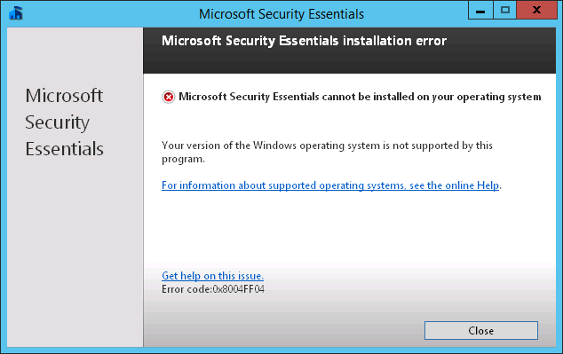
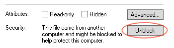
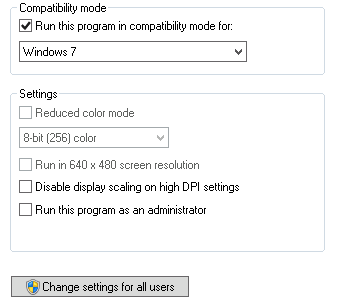

# Installing MSE on Windows Server 2012 R2

Here is one unsupported scenario for **testing** purposes only of installing Microsoft Security Essentials on Windows Server 2012 R2.

If you try to run `mseinstall.exe` you will get an error message: Microsoft Security Essentials cannot be installed on your operating system. Your version of the Windows Operating system is not supported by this program.



Right click on `mseinstall.exe` file and Unblock it on General tab.



Set Compatibility mode to Windows 7. Make sure you set "Change settings for all users" if you edit it by non-admin user.



Start command line as Administrator and run the installer

```cmd
mseinstall.exe /disableoslimit
```