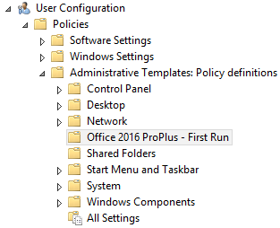
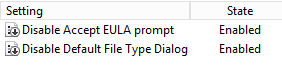

# Microsoft Office 2016 ProPlus - First Run ADMX

Some policy settings which are not included in a default Office 2016 ADMX file. 

The policy allows accepting all first run popups and disables default file type selection (XML/OpenDocument) during the first run.

