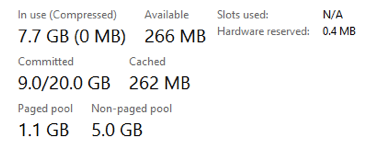
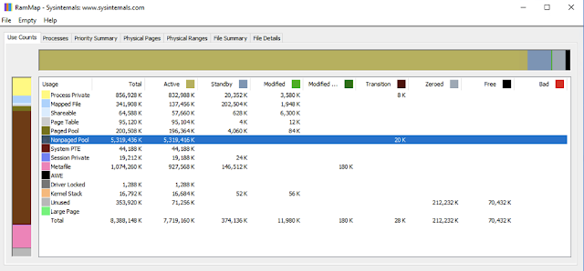
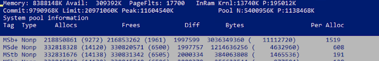
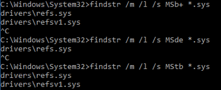

# ReFS - High RAM usage

How to identify and fix high RAM usage on Windows Server 2016 due to ReFS?

As you can see from Task Manager, 5GB is allocated in non-paged pool. This memory is used by kernel and device drivers.

This also can be checked by RamMap tool.

Use `poolmon.exe` tool from WDK to identify what components are using most of memory. Run `poolmon.exe -u -p` in elevated command prompt.

Then use `findstr` tool to find out what device drivers are under MSb+, MSde and MStb tags. Simply run `findstr /m /l /s MSb+ *.sys`. Replace Tag name for each search.

As you can see 4.5GB is allocated by ReFS component. This behavior is expected and fixed by **KB4013429**. More details can be found in [here](https://support.microsoft.com/en-us/help/4016173/fix-heavy-memory-usage-in-refs-on-windows-server-2016-and-windows-10).