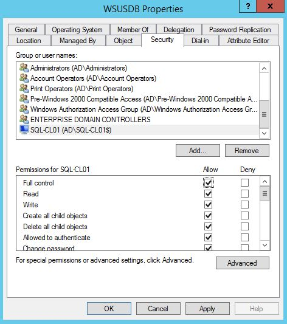

# SQL Server 2016 - Always On Availability Groups

In this blog post I will provide basic step by step guide how to install and configure SQL Server 2016 with Always On Availability Groups. Migration WSUS from Windows Internal Database to Availability Group will be as example.

This guide has the following steps:

[1. Preparation](#prepare)  
[2. Installing SQL Server 2016 on both SQL servers](#install)  
[3. Installing Failover Clustering Feature on SQL servers and enable AlwaysOn](#installfc)  
[4. Working with WSUS](#wsus)  
[5. Create Availability Group](#createaog)  
[6. Create logins and grant permissions](#createlogins)  
[7. Create Availability Group Listener](#createlistener)  
[8. Finish WSUS server reconfiguration](#wsusfinish)

## <a name="prepare"></a> Preparation

Two Windows Servers 2012 R2 - SQL01 and SQL02.

Each SQL server has the following drive mapping:  
C - System  
D - SQL Installation  
E - Database volume  
F - SQL Logs  
G - Backups

WSUS server is Windows Server 2012 R2 with default configuration.

Dedicated Active Directory Organizational Unit for SQL servers computer objects.

Opened firewall TCP ports on both SQL servers - 1433, 1434, 5022.

## <a name="install"></a> Installing SQL Server 2016 on both SQL servers

From SQL Server Installation Center click Installation then "New SQL Server stand-alone installation or add features to an existing installation".


Enter Product Key or select Evaluation, then click Next.

Accept the license terms and click Next.


Select Microsoft Update options and click Next.


On Install Rules page check all warnings. Then click Next.


On Feature Selection page select "Database Engine Services" and "SQL Server Replication". In my case I changed Directories paths to dedicated D: drive. Click Next to Proceed.


Leave default instance name and click Next.


Specify service accounts and collation settings. In my case I left it default and clicked Next.


On "Database Engine Configuration" page specify SQL Server administrators. In my case I selected domain administrator account.


Go to "Data Directories" tab and specify paths. Then click Next.


On Ready to Install page click Install.


Repeat the same steps on second SQL server.

## <a name="installfc"></a> Installing Failover Clustering Feature on SQL servers and enable AlwaysOn

Open Server Manager - Manage - Add Roles and Features - Next - Role-Based or feature-based installation - Next - Select a server from the server pool - Next - Next - Select "Failover Clustering" checkbox (It will popup with additional features required) - Add Features then Next - Install


Repeat the same steps on second SQL server.

Open Failover Cluster Manager, right click on it and "Create Cluster..."


On Before You Begin page click Next.


On Select Servers page add SQL01 and SQL02 servers. Click Next to proceed.


Run validation tests by clicking Next.


Run all tests then Next. Wait until validation completes. Once all tests are passed specify Cluster Name and IP, then click Next. In my case it is SQL-CL01 with 192.168.1.201 as IP.


Confirm configuration and click Next.


Then configure quorum settings.

Enable Always On Availability in SQL Server Configuration Manager on each SQL Server.


Restart SQL servers. Download and install SQL Server Management Studio.

## <a name="wsus"></a> Working with WSUS

Download and install on WSUS server: "Microsoft® SQL Server® 2012 Native Client" and "Microsoft® SQL Server® 2012 Command Line Utilities".

Stop "IIS Admin Service" and "WSUS Service"

Run command line tool as administrator:

```text
cd C:\Program Files\Microsoft SQL Server\110\Tools\Binn
sqlcmd -S \\.\pipe\MICROSOFT##WID\tsql\query
use master
alter database SUSDB set single_user with rollback immediate
go
sp_detach_db 'SUSDB'
go
```

Then copy `SUSDB.mdf` and `SUSDB_log.ldf` from `"C:\windows\WID\Data"` to SQL01.

Working with WSUS database:
Attach database on SQL01.


Go to Database Properties - Options. Amend Recovery model to Full. Then backup the database, copy `SUSDB.bak` file to SQL02 and restore it with `"RESTORE WITH NORECOVERY"` option.


## <a name="createaog"></a> Create Availability Group on SQL01

In SQL Server Management Studio - AlwaysOn High Availability - Availability Groups - New Availability Group Wizard... - Next.

Specify AG name and click Next. In my case it is WSUSAG.


Select SUSDB and click Next.


Add SQL02 as replica. Do not configure listener for now. Click Next and Yes on endpoint popup.


On Initial Data Synchronization page select Skip initial data synchronization and click Next. On validation page click Next then Finish.

## <a name="createlogins"></a> Create logins and grant permissions

On SQL01:

```sql
use master
CREATE LOGIN [AD\SQL02$] FROM WINDOWS
GO
GRANT CONNECT ON ENDPOINT::[Hadr_endpoint] TO [AD\SQL02$]
GO
```

On SQL02:

```sql
use master
CREATE LOGIN [AD\SQL01$] FROM WINDOWS
GO
GRANT CONNECT ON ENDPOINT::[Hadr_endpoint] TO [AD\SQL01$]
GO
```

Remove and add back SQL02 from replicas.


Create WSUSDB computer object in SQL OU and grant full access permissions to SQL-CL01 object.




## <a name="createlistener"></a> Create Availability Group Listener


Specify listener settings and click OK. In my case it is 192.168.1.202, 1433 port and WSUSDB (computer object which I created earlier).


On SQL02 join SUSDB to Availability Group.


The state of database will be changed to Synchronized.

## <a name="wsusfinish"></a> Finish WSUS server reconfiguration

Replace `"MICROSOFT##WID"` with `"WSUSDB"` in `"SqlServerName"` of in `"HKEY_LOCAL_MACHINE\SOFTWARE\Microsoft\Update Services\Server\Setup"`

Change WSUS Service to logon as Local System and grant dbo rights on SUSDB for WSUS01 computer. 

Start "IIS Admin Service" and "WSUS Service".

Uninstall WSUS and Windows Internal Database features:

```powershell
Uninstall-WindowsFeature UpdateServices-WidDB
Uninstall-WindowsFeature Windows-Internal-Database
```

Restart WSUS server.