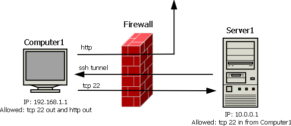
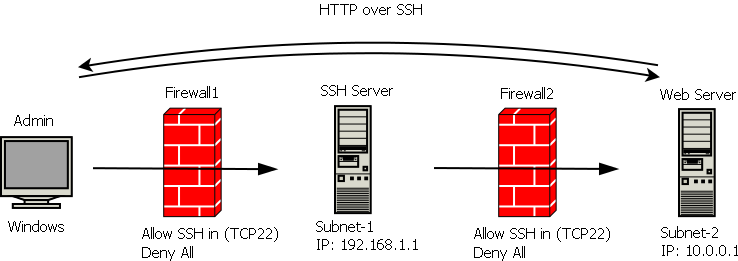

# SSH tunneling usage examples

## First example

Example of using SSH tunneling in a restricted environment. In this case Server1 is a Linux box (Ubuntu 16.04) located in DMZ and it has only SSH in allowed (TCP/22). Using SSH tunneling this Linux box will be updated using **apt** tool.



Connect to Server1 from Computer1 and forward a remote port. Server1 is configured with us.archive.ubuntu.com (91.189.91.26) as a source list for apt tool.

```text
root@Computer1# ssh -R 8080:91.189.91.26:80 username@10.0.0.1
```

After issuing the command Server1 will start listening on port 8080. It can be checked by running “netstat -l”. All connections to 8080 port will be forwarded via Computer1 over ssh.

Then create a local port forwarding by running command below.

```text
root@Server1# ssh -L 80:localhost:8080 username@localhost
```

Server1 will start listening on port 80. All connections to 80 port will be forwarded to 8080, which will be tunneled to Computer1. Doesn’t seem as an elegant solution but it works well in this case.

The final step is amending hosts file. Simply add below to `/etc/hosts`.

```text
127.0.0.1 us.archive.ubuntu.com
127.0.0.1 security.ubuntu.com
```

Then you will be able to update the system via apt tool.

```text
root@Server1# apt update && apt upgrade
```

Alternative way could be using dynamic port forwarding. It is more suitable for servers with GUI. I will not cover apt proxy configuration. Also DNS should be solved as well.

Connect to Server1 from Computer1. By issuing the command below, local ssh tcp 22 port will be forwarded to Server1. It means if you run “ssh localhost 999” on Server1 you will connect to Computer1.

```text
root@Computer1# ssh -R 999:localhost:22 username@10.0.0.1
```

Then on Server1 create a dynamic port forwarding. This will allow Server1 act as a socks proxy.

```text
root@Server1# ssh -D 3128 -p 999 username@localhost
```

You will be able to see both 999 and 3128 ports listening on Server1 by running “netstat -l” command.

Then you need to configure apt or any other app to use socks proxy on localhost 3128.

## Second example

Here is another example of accessing web server in a restricted network. `Plink.exe` command-line tool will be used on Windows admin computer to access SSH Server.


```text
C:\>plink.exe -L 8080:10.0.0.1:80 root@192.168.1.1
```

In this scenario SSH server has a direct access to the Web Server via HTTP. After issuing the command above, client connects to SSH Server and all local connections to TCP port 8080 on Windows workstation are tunneled via SSH to the Web Server’s TCP 80 port. So you are able to type `http://localhost:8080` on Windows system and connect to Web Server behind 2 Firewalls.

In another scenario, SSH Server has only SSH access to Web Server. Thus a second tunnel is required in this case. One from Admin workstation to SSH Server and another one from SSH Server to the Web Server.



```text
C:\> plink.exe -L 8080:localhost:8080 root@192.168.1.1
```

```text
SSHServer# ssh -L 8080:localhost:80 root@10.0.0.1
```

After running the commands above you will be able to access Web Server via browser by typing `http://localhost:8080` address, in scenario when Web Server is located behind 2 Firewalls and only SSH is allowed during all packet travel.