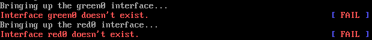

# XEN - IPFire - Interface doesn't exist

Networking issues with IPFire 2.19 installed as HVM on XEN 4.8 (Ubuntu 17.04).

Network configuration GREEN + RED.

Domain VIF config: vif = ['bridge=xenbr0','bridge=xenbr1']

When you destroy and create IPFire domain you get the warnings below:

```text
Interface green0 doesn't exist.        [ FAIL ]
Interface red0 doesn't exist.          [ FAIL ]
```



After IPFire installation, successful configuration you can notice no issue with networking, event if you reboot the domain. Once you destroy domain and create it again, errors appear. Configure VIF with static MAC addresses to solve this problem:

```text
Vif = ['mac=xx:xx:xx:xx:xx:xx,bridge=xenbr0', 'mac=xx:xx:xx:xx:xx:xx,bridge=xenbr1']
```